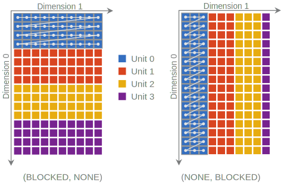
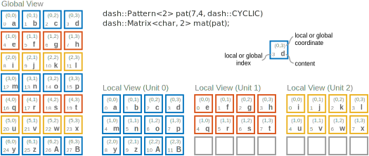
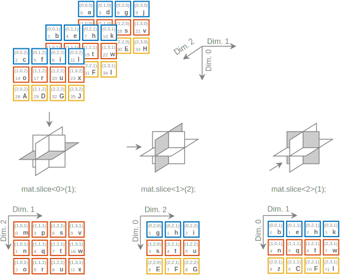

# The DASH Multidimensional Array (NArray)

## Instantiating a DASH NArray

`dash::NArray` is an N-dimensional array container class template. Its constructor requires
at least two template arguments, one for the element type `(int, double, ...)` and one for
the dimension `(N)`.

The following example creates a two-dimensional integer matrix with
40 rows and 30 columns:

```c++
dash::NArray<int,2> matrix(40,30); // 1200 elements
```

The number of required runtime constructor arguments depends on the dimension of
the `dash::NArray`. Except for a default constructed `dash::NArray` object, which requires
no arguments and is used for delayed allocation (see Sect. 1.6.1), we need to at least
specify the extents of the multidimensional array in each dimension. This can be achieved
by either passing an object of type `dash::SizeSpec<N>` or by giving the extent in each
dimension individually. For example:

```c++
// use SizeSpec 20 x30x40 elements:
dash::SizeSpec<3> sspec(20,30, 40);
dash::NArray<int, 3> mat1(sspec );
dash::NArray<int, 3> mat2(dash::SizeSpec<3>(5,5,5));
// specify extents directly, 10000 elem in a 4D cube:
dash::NArray<int, 4> mat3(10,10,10,10);
// unallocated matrices, .allocate() call needed:
dash::NArray<int, 3> mat4, mat5;
// .allocate() accepts similar inputs as the constructor:
mat4.allocate(20,40,10);
mat5.allocate(sspec);
```

Further optional template arguments to specify the index type and storage order (also
called memory arrangement) can be provided when instantiating the `dash::NArray` object.
An example multidimensional array with column-major layout and long as the index type
is shown below:

```c++
dash::NArray<int, 5, dash::COL_MAJOR, long>
matrix(100, 100, 100, 100, 100) ; // 10^10 = 2^33.2 elements 
```

In this example, the number of elements exceeds the range of a 32 bit index type (the
default is `ssize_t` which can be overridden using a build option in DASH) and a 64 bit
index type is thus required.
Additionally, DASH offers both column-major and row-major storag for the elements
(row-major is the default). These options determine the way in which the multi-dimensional
index space is linearized and mapped on to the one-dimensional memory that computers work
with.

For two-dimensional arrays this linearization can either happen row by row (aka. rowmajor
storage) or column by column (aka. column-major storage). For arbitrary dimensions these
definitions can be suitably extended and row-major then means that elements
$(i, j,..., n)$ and $(i, j,..., n + 1)$ are stored next to each other, while in the case of
columnmajor storage $(i, j,..., n)$ and $(i + 1, j, ...)$ are stored next to each other
(not taking into account any possible data distribution among multiple units).

Fig. 1 visualizes the layout of elements in a two-dimensional `dash::NArray`, both with
row-major storage.
A final optional template argument specifies the type of the data distribution pattern
used by the `dash::NArray` to determine the mapping of elements to units and finding their
storage location. The following example shows the most general form, where all template
parameters are explicitly specified.

```c++
using T        = int;                 // element value type
const int NDim = 2;                   // number of dimensions
const auto Arr = dash::COL_MAJOR;     // memory arrangement
using PatT     = dash::Pattern<NDim>; // pattern type
using IndexT   = PatT::index_type;    // index type

dash::NArray<T, NDim, Arr, IndexT, PatT> mat;
```

A `dash::NArray` is always allocated over a `dash::Team`, i.e., a group of units that contribute
storage to hold the data for the container. A team can be specified as an optional last
constructor argument. If no team is explicitly specified, it defaults to `dash::Team::All()`,
the group of all units that exits when the program starts.

```c++
dash::Team & t = dash::Team::All().split (2);
// 100x100 elements allocated over t:
dash::NArray<int,2> mat(100,100,t);
```

## Data Distribution

DASH offers a wide range of data distribution schemes using the
`dash::Pattern` class template. Each `dash::NArray` has an associated
pattern, which can be queried with the `.pattern()` method.
The pattern is set when the `dash::NArray` is created and a user-defined
pattern can be specified explicitly:

```c++
dash::Pattern<2> pat = ...
dash::NArray<2,int> mat(pat);
```

A pattern's job is to provide the mapping between local and global
index spaces, taking into account data distribution and memory layout.

This functionality is needed by the `dash::NArray` and the other DASH
containers for accessing and iterating over their elements. In contrast
to a container, a pattern is independent of an element type, its
construction is *not* a collective operation and does *not* cause any
global memory allocation.

DASH offers several types of data distribution patterns.
The most basic pattern is the *blocked pattern*, where each unit holds
one or more contiguous blocks of elements. A blocked pattern can be
instantiated using the `dash::Pattern` class template.

```c++
// 2D pattern, blocked in the first dimension
dash::Pattern<2> pat1(16, 10, dash::BLOCKED, dash::NONE);

// 2D pattern, blocked in the second dimension
dash::Pattern<2> pat2(16, 10, dash::NONE, dash::BLOCKED);

// 2D default blocked pattern
dash::Pattern<2> pat3(16,10); // same as pat1
```

Per default the pattern is blocked (`dash::BLOCKED`) in the
first dimension and there is no distribution in the other dimensions
(`dash::NONE`). Two examples for a blocked pattern are shown
in Fig~\ref{fig:pattern-blocked}. In both cases, the pattern specifies a
two-dimensional $16\times 10$ index space that is distributed over four
units. In the left example, the first dimension is specified as
`dash::BLOCKED` while no distribution is requested in the
second dimension, so each unit receives 4 complete rows. In the second
example, the blocking is done over the second dimension. Note that the
block size is determined by dividing the number of columns by the
number of units and rounding up to the next integer. So the number of
block columns in this example is $\left \lceil{10/4}\right \rceil = 3$
and the last unit (unit 3) is underfilled.




## Accessing Elements

The individual elements of a `dash::NArray` can be accessed in one of
the following ways:

- By specifying N coordinate values, e.g., `mat[i][j][k]`,
- by using a linear index, e.g., `mat.elem(33)`,
- by dereferencing an iterator, e.g., `*(mat.begin())`.

### Access using Coordinates

An element in an N-dimensional matrix `mat` can be accessed by specifying
its N-dimensional coordinate vector
$(i_0, i_1, \dots, i_{N-1})$.

Naturally, all coordinate values must be within the allowed range for
each dimension such that $0 \leq i_k < $ `mat.extent(k)`.

To compute the sum of all elements in a three-dimensional matrix one
could for example use the following loop nest:

```c++
for( auto i=0; i < mat.extent(0); i++ ) {
  for( auto j=0; j < mat.extent(1); j++ ) {
    for( auto k=0; k < mat.extent(2); k++ ) {
       sum+=mat[i][j][k];
    }
  }
}
```

Note that `mat[i][j][k]` is interpreted as `mat[i])[j])[k]`.
From left to right, each application of a subscript operator returns a
*matrix view* with a dimension reduced by one until the last subscript
operates on a one-dimensional view and returns a global reference to the
requested element.

Another and potentially more efficient way to access an element is to
directly specify the coordinates in "Fortran style" by using round
brackets in the form `mat(i, j, k)`, which yields the same element as
`mat[i][j][k]`. Besides N individual coordinates, the coordinate vector
can be also be specified as a `std::array` of length N or by using an
initializer list with N arguments.

The same forms of input are also supported for the `.at()` method.
The difference is that `.at` performs a boundary check on each access and
throws an xxx exception if an out-of-bounds condition is encountered.
The following example illustrates these options to access a matrix using
coordinates.

```c++
dash::Matrix<int, 3> mat(10, 10, 10);

int i=2, j=3, k=5;
std::array<int, 3> coords = {i, j, k};

auto r1 = mat[i][j][k];      // chained subscripts

auto r2 = mat.at(i, j, k);   // N arguments
auto r3 = mat.at(coords);    // std::array        @\warn@
auto r4 = mat.at({i, j, k}); // initializer list  @\warn@

auto r5 = mat(i, j, k);      // N arguments
auto r6 = mat(coords);       // std::array        @\warn@
auto r7 = mat({i, j, k});    // initializer list  @\warn@
```

### Access using Linear Indices and Iterators

The elements in a DASH matrix `mat` can be accessed in their linearized
storage order by using the `mat.elem(gidx)` method.
`gidx` is a global linear index with $0 \leq$ `gidx` $ < $ `mat.size()`.

The following example initializes all elements of a two-dimensional
`dash::NArray` to their position in the linear storage order.

```c++
// 2D pattern, 8 rows and 5 columns
dash::Pattern<2, dash::ROW_MAJOR> pat1(8, 5); // row major
dash::Pattern<2, dash::COL_MAJOR> pat2(8, 5); // column major

dash::Matrix <int, 2, ...> mat1(pat1);
dash::Matrix <int, 2, ...> mat2(pat2);

if( myid==0 ) {
  // set the i-th element in the respective storage order to 'i'
  for(int i=0; i < mat1.size(); ++i ) { mat1.elem(i)=i; } @\warn@
  for(int i=0; i < mat2.size(); ++i ) { mat2.elem(i)=i; } @\warn@
}
dash::barrier();

//   mat1:                mat2:
//   0  1  2  3  4        0  8  16 24 32
//   5  6  7  8  9        1  9  17 25 33
//   10 11 12 13 14       2  10 18 26 34
//   15 16 17 18 19       3  11 19 27 35
//   20 21 22 23 24       4  12 20 28 36
//   25 26 27 28 29       5  13 21 29 37
//   30 31 32 33 34       6  14 22 30 38
//   35 36 37 38 39       7  15 23 31 39
```

A similar linear iteration over all elements in a matrix can be
achieved using the iterator interface. In analogy to the container
classes offered by the STL the DASH containers offer iterator types
and the ability to walk over the elements contained in the matrix. For
example:

```c++
using matrix_t = dash::Matrix<int, 2>;
matrix_t mat(20, 10);

// search for '42' staring from the back
bool found = false;
for (matrix_t::reverse_iterator it = mat.rbegin();
     it != mat.rend(); ++it) { @\warn@
  if ((*it) == 0) {
    found = true; break;
  }
}

// set all elements to 0, starting from the front
for (matrix_t::iterator it = mat.begin(); it != mat.end(); ++it) {
  (*it) = 0;
}
```


## Working with Local Data

DASH provides distributed data structures where each processing unit
can conveniently access any data element. However, accessing remote
data may require significantly more time and energy than working on
locally stored data. This is true in distributed memory systems, where
data has to be transmitted over a network connection, but the same
consideration also holds on shared memory NUMA systems, where memory
access times depend on data placement. To efficiently support NUMA and
distributed memory systems, DASH thus offers a strong notion of *data
locality*.

Each element in a container has a well defined home unit and it is
straightforward to implement the so-called "owner-computes" scheme
where several units collectively operate on a container, each operating
on its locally stored elements.

Data distribution patterns define the home location for each element
when a DASH container is instantiated.

To determine if an element is local to the calling unit, the method
`is_local()` is available. `is_local()` can be used with global
references and global pointers and returns whether the referenced object
resides in the calling unit's local memory.

For example, in the following code fragment all units iterate over all
elements in a matrix, but only the owning unit prints a line declaring
its ownership.

```c++
auto myid = dash::myid();
dash::Matrix<int, 2> matrix(8, 15);

for (int i = 0; i < matrix.extent(0); i++) {
  for (int j = 0; j < matrix.extent(1); j++) {
    if (matrix(i, j).is_local()) {
      cout << "Element (" << i << "," << j << ") is "
           << "owned by me! (unit " << myid << ")" << std::endl;
    }
  }
}

// prints the following:
// Element (0,0) is owned by me! (unit 0)
// Element (2,0) is owned by me! (unit 1)
// Element (4,0) is owned by me! (unit 2)
// ...
```

Note that while this approach realizes the owner-computes pattern, it is
not very efficient, since each unit inspects all elements and only then
finds out whether to print a message or not. A more effective way to
exploit data locality is to only iterate over the locally stored elements
in the first place.

In DASH this can be achieved constructing a container's *local view* using
the `.local` specifier. Using `.local` on a container restricts the access
to only those elements that are local to a unit and, since global pointers
and references are no longer needed in the purely local setting, instead
of returning a global reference, a regular C++ reference to the element is
returned when using the local view:

```c++
dash::Matrix <double, 2> mat(8,15);
mat.local(0,0) = 33;    // set element at local coordinates (0,0) to 33

auto loc = mat.local;   // this unit's local view on the matrix
loc(1,1) = foo();       // set local elem (1,1) to result of foo()
cout << loc.elem(5);    // print the sixth local element

// get the address of the first local element
double *ptr = &(loc.elem(0));
```

It is important to note that when using the local view specifier, all
coordinates and indices used to access elements have local meaning as
well. I.e., `mat.local.elem(0)` is the first element stored locally,
`mat.local.at({3,5})` is the element with local coordinates $(3,5)$, etc.

Other than the different semantics, the same element access operations that
are available for global addressing can also be used for the local view,
including iterator-based access.

Since iterating over all locally stored elements is a common operation, the
`dash::NArray` class template offers a shorthand to get the local begin and
end iterators: `mat.lbegin()` is short for `mat.local.begin()` and `mat.lend()`
is short for `mat.local.end()`.
Naturally these iterators can be used with C++ 11 range-based for loops:

```c++
// set all my local elements to my DASH unit ID
for( auto it=mat.lbegin(); it!=mat.lend(); ++it ) {
  (*it)=dash::myid();
}

// print local portion of the matrix using a range-based loop
for( auto el : mat.local )
  cout << el << " ";
cout << endl;
```



Figure 2 shows an example for global and local addressing.
Here, a $(7 \times 4)$ matrix of `char` elements is distributed cyclic by rows
among three units.
The global view is identical for all units and allows element access by global
coordinates or global index.
For example `mat(1,3)` is the same as `mat.elem(7)` and resolves to element
`'h'`.
The local view is specific to each unit so that `mat.local(1,3)` takes on the
values `'p'`, `'t'`, or `'x'` for unit 0, 1, and 2, respectively.

Should it become necessary to manually map between local and global indices or
coordinates, the container's pattern can be used. For example, the global
index for a unit's first local matrix element can be determined as
`gidx = mat.pattern().global(0)`.

See Sec. *Patterns* for more information on the mapping functions offered by a
pattern.

**Element Access for a D-dimensional NArray / NArray View**

Method                  | Synopsis
----------------------- | -------------------------------------------------
`operator()(i,j, ...)`  | Element at global coordinates $(i, j, \dots)$
`at(i,j, ...)`          | Boundary-checked access at global coordinates
`elem(i)`               | Element at global canonical offset $i$
`operator[](i)`         | View of the $i$-th $D-1$ dimensional submatrix


## Matrix Views

Besides the local view, the DASH NArray / Matrix concept offers a number of other
convenient operations that result in matrix views.

### Slicing

Sometimes it is convenient to work with lower-dimensional parts of a matrix.
For example, in a 2-dimensional Matrix it might be useful at times to restrict
our focus to just a particular row or column.
Similarly, one might logically want to organize one's domain using a three
dimensional data structure but work with two-dimensional slices at a time.
The method `sub()` can be used create a sub-space view of a DASH matrix.

At least two parameters are required to use `sub()`: the first parameter is a
template parameter and specifies the dimension to restrict the access to and
the second parameter selects a subspace in this dimension.

Consider the following example:

```c++
// 10 rows, 6 columns
// So, for example:
dash::Matrix<int, 2> mat(10,6);

// i-th row
auto sub1 = mat.sub<0>(i);

// j-th column
auto sub2 = mat.sub<1>(j);

//Here is a three dimensional example:
// 10 rows, 6 columns
//So, for example:
dash::Matrix<int, 2> mat(10,6);

mat.slice<0>
```



Figure 3 shows two simple examples for a $16 \times 10$ DASH blocked pattern,
with blocking over the rows (left) or columns (right).


## Global Memory Management

### Delayed Allocation

### Using Pre-allocated Memory
 
