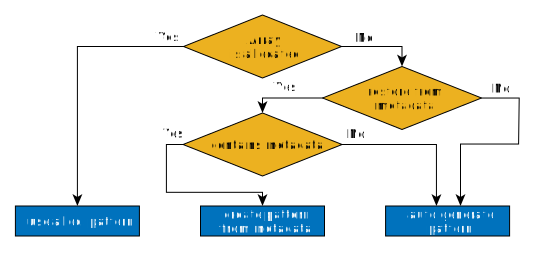

# The DASH HDF5 API
The HDF data format is commonly used to store (possibily) heterogeneus data in binary format.
As the file contains an index, the data is portable between different systems, even if the data types on source and target systems vary in length. Hence, the data can be easily processed later on with a variety of tools. Each file consits of zero to many datasets holding the data and additional metadata. For detailed information on the HDF5 format, see [www.hdfgroup.org](https://www.hdfgroup.org/HDF5/).

As DASH arrays provide well-defined distributed memory, the containing data can be directly passed to the parallel hdf5 API. For that, the distribution pattern is queried from the array and reverse engineered as an hdf5 pattern. The DASH HDF5 API automates this process and provides a simple user interface for loading and storing data.

The DASH API is capable of reading and storing `dash::Array` and `dash::Matrix` containers. Hence, all examples work with both types of containers.

## Using the API
DASH implements two different kinds of the API, which provide exact the same functionality. The first variant is driven by using function calls, while the second (recommended) provides a stream based approach, similar to the C++ iostream library. In future versions of DASH the first variant will be deprecated and removed.

In its simples form, an `dash::Array` or `dash::Matrix` is written by passing a filename, the dataset and the array to the API. For example:

```cpp
dash::Array<double> array(1000);
dash::io:StoreHDF::write(array, "file.hdf5", "dataset");

// Same as
dash::io::hdf5::OutputStream os("file.hdf5");
os << dash::io::hdf5::dataset("dataset") << array;
```

Data from and hdf5 file can be easily read in a similar way:

```cpp
dash::Array<double> array;
dash::io:StoreHDF::read(array, "file.hdf5", "dataset");

// Same as
dash::io::hdf5::InputStream is("file.hdf5");
is >> dash::io::hdf5::dataset("dataset") >> array;
```

## Options
To specify how to deal with already existing files, datasets and pattern metadata, the API provides stream modifiers:

```cpp
dash::io::hdf5::OutputStream os("file.hdf5");
os   << dash::io::hdf5::dataset("dataset")
     << dash::io::hdf5::store_pattern(false)
     << matrix;
```

For a full list of all options have a look at the DASH API documentation.

## Adding and Manipulating Data
It is possible to add more datasets to a single hdf5 file. To this, the append option has to be set, as the default behaviour is to overwrite the hdf5 file.

```cpp
// Store two matrices
dash::Matrix<int,2> matrix_a(100, 100);
dash::Matrix<int,3> matrix_b(10, 15, 20);

dash::io::hdf5::OutputStream os("file.hdf5", dash::io::hdf5::DeviceMode::App);
os << dash::io::hdf5::dataset("pressure")
   << matrix_a
   << dash::io::hdf5::dataset("temperature")
   << matrix_b;
```

In addition, already existing datasets can be modified, if the extents of the new data match the extens of the dataset.
For various reasons, it is not checked if the file already contains a dataset with the given name. Overwriting a non existing dataset leads to a runtime error.
Hence, the option `modify_dataset` has to be set if and only if an already existing dataset should be modified.

```cpp
// Modify dataset
dash::Matrix<int,2> matrix_a(100, 100);
dash::Matrix<int,2> matrix_b(100, 100);
dash::io::hdf5::OutputStream os("file.hdf5", dash::io::hdf5::DeviceMode::App);
os << dash::io::hdf5::dataset("temperature")
   << matrix_a
   << dash::io::hdf5::modify_dataset()
   << matrix_b;
```

## Custom Datatypes

As HDF5 is a self describing data format, native C/C++ datatypes have to be converted into their HDF5 equivalents.
For the most common primitive types like `int`, `float`, etc. DASH brings a conversion function.
If not specified by the user, this conversion is done implicitly in DASH's HDF5 storage driver.
However, if you store data of other types in DASH containers, this conversion cannot be done automatically.
Therefor the driver provides an IO manipulator (`type_converter`) to set a custom conversion function.
The probably most common case, using a struct type, is shown in the following example:

```cpp
// Struct that is stored in DASH array
struct value_t { double a; int b; };

// Conversion function
auto converter = [](){
    hid_t h5tid = H5Tcreate (H5T_COMPOUND, sizeof(value_t));
    H5Tinsert(h5tid, "a_name", HOFFSET(value_t, a), H5T_NATIVE_DOUBLE);
    H5Tinsert(h5tid, "b_name", HOFFSET(value_t, b), H5T_NATIVE_INT);
    return h5tid;
  };

dash::Array<value_t> array_a(1000);
// [...]
// store data
OutputStream os(_filename);
    os << dio::dataset("array_a")
       << dio::type_converter(converter)
       << array_a;

// restore data
dash::Array<value_t> array_b(1000);
InputStream is(_filename);
is >> dio::dataset("array_a")
   >> dio::type_converter(converter)
   >> array_b;
```

For details how to implement the conversion function, see DASH's [API documentation](https://codedocs.xyz/dash-project/dash/) as well as 
the [HDF5 type documentation](https://support.hdfgroup.org/HDF5/doc/UG/HDF5_Users_Guide-Responsive%20HTML5/index.html#t=HDF5_Users_Guide%2FDatatypes%2FHDF5_Datatypes.htm).

## DASH Pattern Handling
By default, DASH stores the pattern layout as metadata in the hdf5 file. When reading back the file, DASH checks if it contains pattern metadata and creates the new pattern according to the metadata.

However there are some situations where this is not desired. Therefor DASH provides three different ways to specify the pattern creation when reading data:

1. Create pattern according to metadata
2. Pass allocated `dash::Array`
3. Auto derive pattern

In this cases, the pattern creation is handled as described in Figure.


*Flowchart of pattern creation for various scenarios`*


## Limitations
### Statically Typed C++
As C++ is a statically typed programming language, the type of the pattern has to be known at compile time. Hence, the type of the Array or Matrix that is passed to `StoreHDF::read()` defines the type of the pattern. This can be problematic, if the given pattern does not support underfilled blocks and the extents of the hdf5 dataset are not divisable by the tilesize.

In case of the `dash::Matrix`, the pattern has to be specified explicitly as the default is a tile pattern which does not support underfilled blocks. This can cause a runtime error if the pattern should be restored according to the metadata, but a different number of units is used.

### Supported Pattern Types
While DASH provides many different pattern types for the containers, the DASH HDF5 API currently only supports block and tile patterns. Passing containers with other pattern types will lead to a runtime error. These constraints are checked by making use of the pattern properties.

### Parallel File System
As DASH uses the parallel HDF5 API, it is strongly recommented to read and write to a parallel file system (e.g. GPFS). Otherwise the IO performance will decrease massively.
